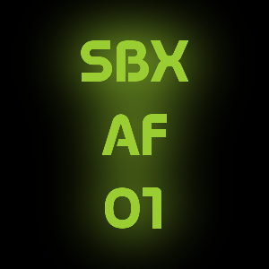

# OpenLens Icon Generator

 

This project/script will generate color coded text images which can be used as OpenLens icons for kubernetes environments. I was
managing a bunch at one point and wrote this scrpt up some time in 2023. I found it today and decided to release it here. I have
no plans to maintain, modify or update this script at this moment.

Use this code/project as a starting point for your naming conventions if you like. This script generates icons in the following format

```
ACT
RGN
ENV
```

ACT: Account Code/Identifier

RGN: Region Code

ENV: Environment

Of course you can change whatever you wish to fit your needs.

## Dependencies

### Perl

This is a perl script, you'll need perl. And `File::Basename` module which should be in core.. I think.

### ImageMagick

This script uses [Text Glow](http://www.fmwconcepts.com/imagemagick/textglow/index.php) by Fred Weinhaus, which is a wrapper
around ImageMagick, that produces a nice glow effect behind the text.

### Fonts

You'll also need to know where your font files are, which should be compatible with ImageMagick, and be able to reference said
fonts in the script. I'm uploading a few "cool" ones I found on the net to this repo. I do not claim any ownership or copyright
over these fonts. I don't recall where I got them. If the owners take issue with my hosting them here, let me know and I'll take
them down. MagettasDemoBold had the most legible + cool factor, so I went with that. Feel free to use whatever font you like.

# Customizing the script

This script references paths on my computer. Update those to suit your needs.

# Running the script

`perl generate.pl`

# Output / Examples

Have a look in the examples folder to see, well, examples of what these icons will look like in the various colors.

# Contributions

I'm not looking for contributions at the moment, but submitting a PR would be the best way to fix any issues or propose
enhancements.